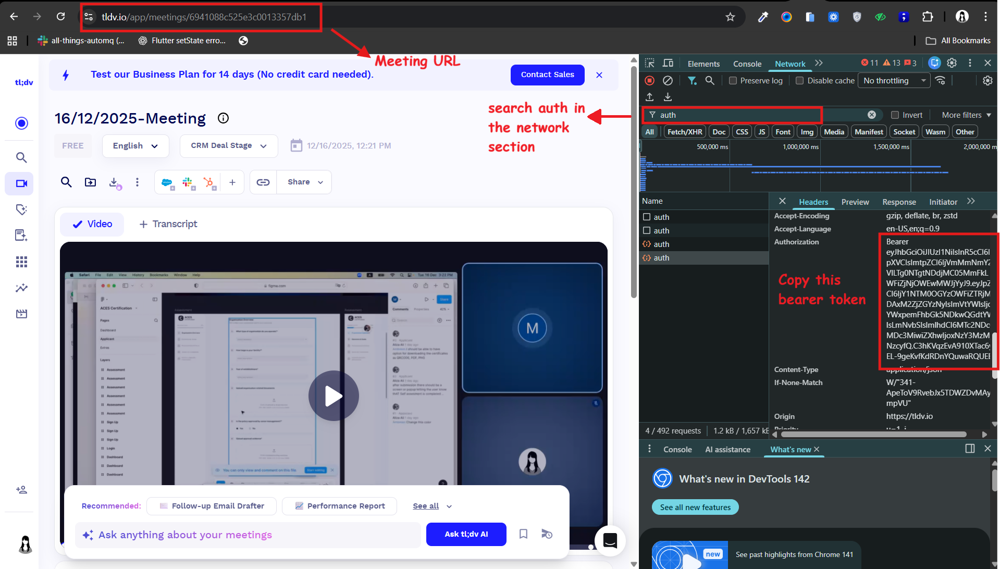

# TLDV Video Downloader

[](https://choosealicense.com/licenses/mit/)
[](https://www.python.org/)
[](https://ffmpeg.org/)

> **Download your TLDV meeting recordings instantly — by [Aliza Ali](https://github.com/AleezaAdnan)**

A lightweight Python CLI tool to download [TLDV](https://tldv.io) meeting recordings for offline viewing. Saves the video, metadata, and full transcript with timestamps and speaker names.

## Features

- **Fast Downloads** — Direct video stream copy from TLDV servers (no re-encoding)
- **Transcript Export** — Saves meeting transcripts with timestamps and speaker names
- **Flexible Input** — Pass meeting URL and token via CLI flags, environment variables, or interactive prompts
- **Auto-detect FFmpeg** — Finds ffmpeg on your PATH automatically
- **Cross-Platform** — Works on Windows, macOS, and Linux
- **Beautiful Progress UI** — Rich terminal interface with real-time download stats

## Prerequisites

- Python 3.6+
- [FFmpeg](https://ffmpeg.org/download.html)

## Installation

```bash
# Clone the repository
git clone https://github.com/AleezaAdnan/tldv-video-downloader.git
cd tldv-video-downloader

# Install dependencies
pip install -r requirements.txt
```

### Install FFmpeg

| Platform | Command |
|----------|---------|
| **Windows** | `winget install ffmpeg` |
| **macOS** | `brew install ffmpeg` |
| **Linux** | `sudo apt install ffmpeg` |

Or download from [ffmpeg.org](https://ffmpeg.org/download.html) and add to your PATH.

## Usage

### Interactive mode (easiest)

```bash
python tldv.py
```

You'll be prompted for the meeting URL and token.

### Command-line flags

```bash
python tldv.py --url "https://tldv.io/app/meetings/abc123" --token "Bearer eyJ..."
```

### Environment variables

```bash
export TLDV_URL="https://tldv.io/app/meetings/abc123"
export TLDV_TOKEN="Bearer eyJ..."
python tldv.py
```

### All options

```
usage: tldv.py [-h] [-u URL] [-t TOKEN] [-o OUTPUT_DIR] [--ffmpeg FFMPEG] [--ffprobe FFPROBE]

Options:
  -u, --url URL           TLDV meeting URL or meeting ID
  -t, --token TOKEN       Authorization token (Bearer token from browser dev tools)
  -o, --output-dir DIR    Directory to save downloaded files (default: current directory)
  --ffmpeg FFMPEG         Path to ffmpeg binary (auto-detected if not provided)
  --ffprobe FFPROBE       Path to ffprobe binary (auto-detected if not provided)
```

## How to Get Your Auth Token

1. Go to [tldv.io](https://tldv.io) and log in
2. Navigate to the meeting you want to download
3. Press **F12** to open browser developer tools
4. Click the **Network** tab
5. Refresh the page (**Ctrl+R** / **Cmd+R**)
6. Look for a request named `auth` or `watch-page`
7. Click the request and find the `Authorization` header — copy the full `Bearer eyJ...` value



## Output

The script generates three files in the output directory:

| File | Description |
|------|-------------|
| `YYYY-MM-DD-HH-MM-SS_MeetingName.mp4` | Meeting video |
| `YYYY-MM-DD-HH-MM-SS_MeetingName.json` | Raw API metadata |
| `YYYY-MM-DD-HH-MM-SS_MeetingName_transcript.txt` | Formatted transcript |

### Transcript format

```
[00:00] Speaker Name: Hello everyone, welcome to the meeting.
[00:15] Another Speaker: Thanks for having me.
[01:30] Speaker Name: Let's get started with the agenda.
```

## Important Notes

- **Tokens expire** — You may need to get a fresh token periodically
- **Only download meetings you have access to**
- **Never commit your token** — The `.gitignore` excludes `.env` files

## Contributing

Contributions are welcome! Please feel free to submit a Pull Request.

## Author

**Aliza Ali** — [GitHub](https://github.com/AleezaAdnan)

## License

This project is licensed under the MIT License — see the [LICENSE](LICENSE) file for details.
